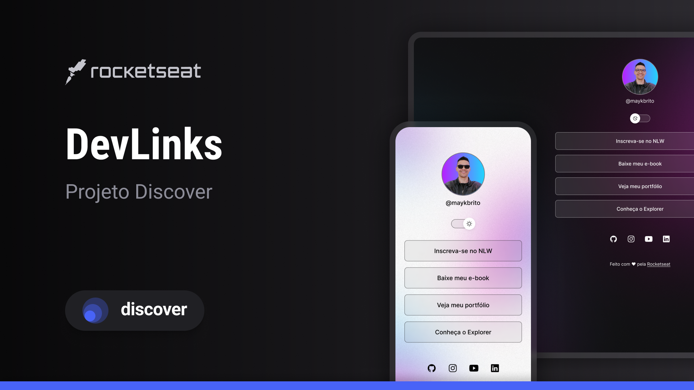

<h1 align="center"> DevLinks (Gerenciador de Links) </h1>

Programa exclusivo e gratuito, promovido pela Rocketseat para ensino de tecnologias WEB.  

  

## 🚀 Tecnologias

Esse projeto foi desenvolvido com as seguintes tecnologias:

- HTML e CSS
- JavaScript
- Git e Github
- Figma

## 💻 Projeto

O DevLinks é um agregador de links para usar como cartão de visitas online.

## 🦾 Aprendizado

Adquiri diversos novos conhecimentos, principalmente sobre CSS, que foi muito bem explicado pelo Mayk Brito!
